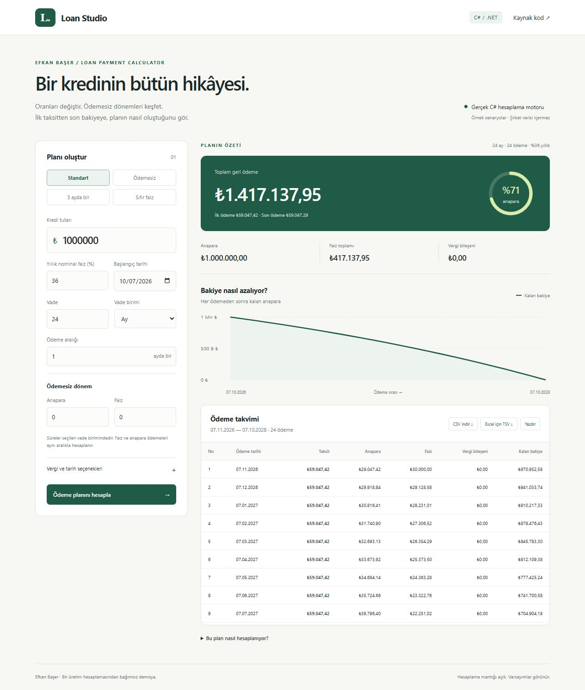

# Loan Studio

A C# loan payment calculator with a working visual demo: principal and interest grace periods, configurable payment intervals, a balance chart and an exportable payment schedule.

Originally developed by **Efkan Başer** for professional work and adapted into a standalone project. The demo uses the updated calculation, with company database dependencies removed. The original public `app.cs` remains in the repository as a historical reference and is not compiled.



## Run locally

Requires the **.NET 10 SDK**. No database, private package feed, Node installation or company network is needed.

```sh
dotnet run --project src/LoanPaymentCalculator.Demo --urls http://localhost:5187
```

Open **http://localhost:5187**. Calculations run in C# on the local server; the browser renders the response. This repository provides a runnable demo, not a publicly hosted calculation endpoint.

Alternatively, with Docker installed:

```sh
docker build -t loan-studio .
docker run --rm -p 5187:8080 loan-studio
```

The Docker recipe is provided; the local .NET build is the verified execution path.

## Explore the demo

- Standard repayments, a grace-period example, quarterly payments and zero-interest presets.
- Day, month and year terms; a shared payment interval for principal and interest.
- Adjustable KKDF/BSMV inputs, defaulting to zero. These are example inputs, not current statutory rates.
- Optional weekend and caller-supplied holiday shifting.
- Total payment, principal, interest and a **derived tax component**.
- Balance chart, full payment table, Turkish-locale CSV/TSV and print layout.
- Responsive layout; edited inputs mark the previous result as stale and disable export until recalculated.

## Calculation contract

This extraction intentionally preserves the updated source calculation's arithmetic. It is not a replacement with a generic annuity formula, and it does not claim to reproduce every bank's repayment rules.

1. The input rate is **annual nominal percent**. Monthly periods divide it by 12; daily periods use a fixed 365-day divisor. Longer payment intervals compound the per-unit rate. The historical `faizVade` argument is retained by the extracted method but does not change this conversion.
2. Principal and interest share a payment interval. The demo rejects non-aligned grace periods rather than silently truncating a fraction of an interval.
3. Interest-grace accrual in the updated source includes the initial step (`i = 0`). This source-specific behavior is preserved and explicitly tested. The first interest settlement may differ from later regular payments; a single remaining repayment has its own source behavior.
4. Money is calculated with C# `decimal`. Regular instalments and interest use the source's two-decimal, midpoint-to-even rounding. The last instalment closes the remaining principal; it can differ by cents. The API parses the original formatted output, so displayed rows and exports use the same precision.
5. `TaxComponent = Payment - Principal - Interest`, derived from each original output row. It includes any rounding residual and is not a separate KKDF/BSMV ledger. At longer intervals the original code compounds taxed and untaxed rates separately.
6. Dates advance from the previous date with `AddDays`, `AddMonths` or `AddYears`. A month-end clamp carries into following payments. Business-day shifting changes payment dates, not interest amounts.
7. Holidays are supplied by the caller. The standalone adapter includes supplied holidays beyond nominal maturity so a shifted final payment does not miss them. No official holiday database is bundled.

The web boundary adds input validation and bounded requests. Invalid schedules return HTTP 400 with an explanation. The app does not store submitted values.

## Verification

```sh
dotnet build LoanPaymentCalculator.slnx --configuration Release
dotnet run --project tests/LoanPaymentCalculator.Checks --configuration Release --no-build
```

The dependency-free check runner exits unsuccessfully on a failed check. Its 12 cases include hand-calculated one-payment and tax references, zero-interest final-cent correction, three-month compounding, interest-only payments, source-specific grace behavior, leap-year month ends, weekend/holiday shifting and invalid inputs. These checks cover the stated scenarios; they are not independent certification of a financial model.

GitHub Actions builds the solution, executes the checks and publishes a runnable web artifact. The UI was also checked locally for preset changes, stale results, validation and a 390px mobile viewport.

## Structure

```text
src/LoanPaymentCalculator.Core/     Extracted calculation + typed adapter
src/LoanPaymentCalculator.Demo/     ASP.NET Core API + plain HTML/CSS/JS
tests/LoanPaymentCalculator.Checks/ Executable calculation checks
docs/                              Screenshot and extraction notes
app.cs                             Historical public snippet
```

## API example

```json
{
  "principal": 1000,
  "annualRate": 12,
  "term": 1,
  "period": "Ay",
  "paymentInterval": 1,
  "principalGrace": 0,
  "interestGrace": 0,
  "kkdf": 0,
  "bsmv": 0,
  "startDate": "2026-01-01",
  "shiftBusinessDays": false,
  "holidays": []
}
```

POST to `/api/schedule`. This example produces a February 1 payment of 1,010, including 1,000 principal and 10 interest. The response contains rows, totals and the original six-column TSV.

MIT licensed; see [LICENSE](LICENSE).
